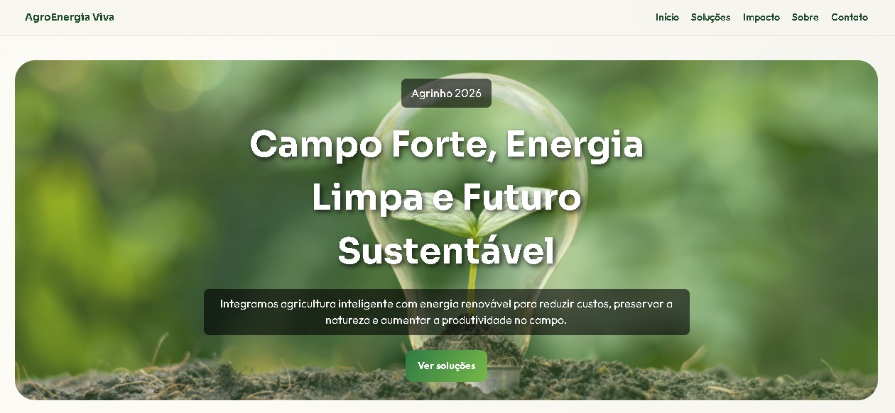

# 🌱 AgroEnergia Viva

Este projeto foi desenvolvido para o projeto **Agrinho**, com foco na integração entre agropecuária e energia sustentável. A proposta busca valorizar o uso de tecnologias limpas no campo, contribuindo para a redução dos impactos ambientais e fortalecendo a produção rural de forma consciente e inovadora.

## 🚜 Objetivo do Projeto

O site tem como finalidade apresentar informações sobre sustentabilidade no meio rural, destacando práticas de geração de energia limpa e soluções tecnológicas aplicadas ao agronegócio.

## 💻 Tecnologias Utilizadas

- HTML5
- CSS3
- JavaScript

## 🎨 Funcionalidades

- Página responsiva
- Layout moderno e intuitivo
- Seções informativas sobre agro e energia sustentável
- Formulário de contato
- Efeitos visuais com CSS e JavaScript

## 📂 Estrutura do Projeto

```bash
📁 projeto-agroenergia
 ├── index.html
 ├── sobre.html
 ├── style.css
 ├── script.js
 └── img/
```

## 🌎 Tema do Projeto

A proposta do projeto reforça a importância da união entre:

- Sustentabilidade
- Tecnologia
- Produção agrícola
- Energia renovável

## 📸 Prévia do Projeto

Adicione aqui imagens ou screenshots da página.




## 👨‍💻 Autor

Desenvolvido por **Daniel Pereira da Silva** para o projeto **Agrinho 2026**.

## 📄 Licença

Este projeto é de caráter educacional e sem fins lucrativos.